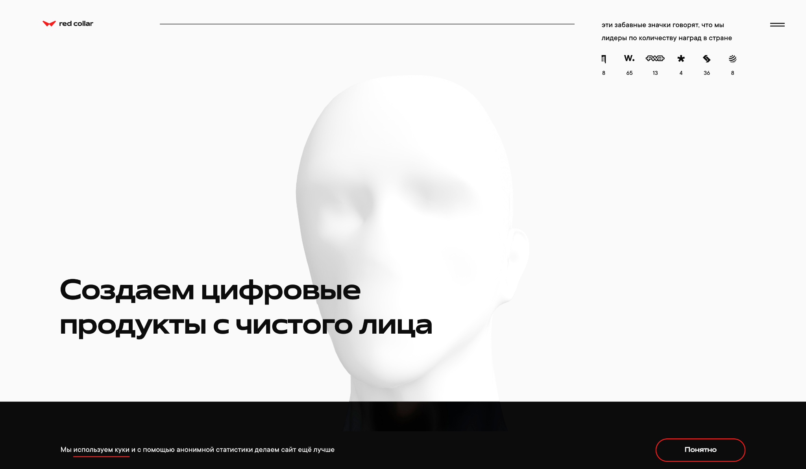
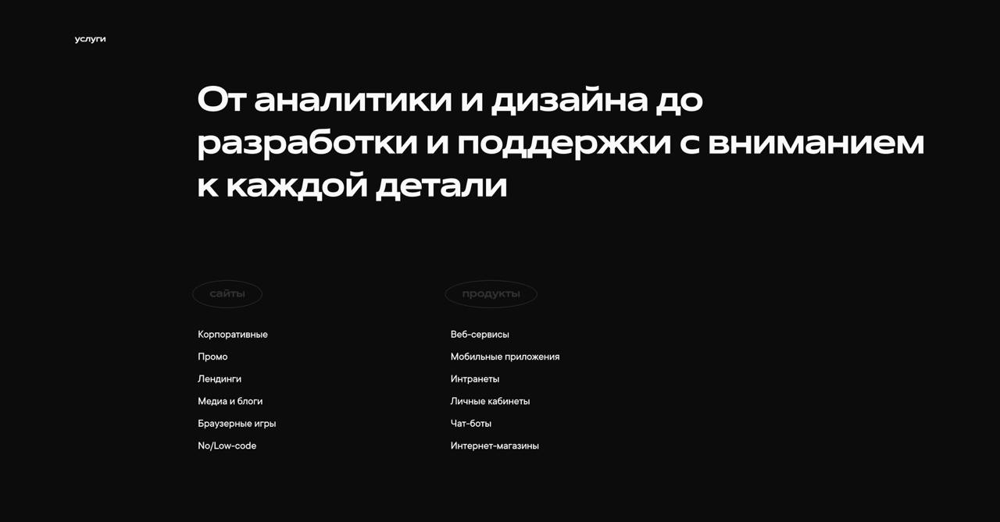

# АНАЛИЗ СОВРЕМЕННЫХ САЙТОВ

## ЛАБОРАТОРНАЯ РАБОТА №11 по дисциплине «Веб-технологии»

**Выполнил:** Студент группы 241-672 Ефименко Т.Е.

### 1. Анализ сайтов и свойств

#### 1.1 Подборка сайтов

| №  | Название сайта          | Ссылка                       | Краткое описание                   |
| --- | ----------------------- | ---------------------------- | ----------------------------------- |
| 1   | АИС                     | https://ais.ru               | Корпоративный сайт, IT-решения     |
| 2   | Art. Lebedev Studio     | https://www.artlebedev.ru    | Дизайн-студия, графический дизайн  |
| 3   | Bang Bang Studio        | https://bangbangeducation.ru | Образовательный портал, дизайн     |
| 4   | Notamedia               | https://notamedia.ru         | Медиа-студия, digital-решения      |
| 5   | Creative People         | https://creativepeople.ru    | Креативная студия, digital-маркетинг |
| 6   | ONY                     | https://ony.ru               | Дизайн-студия, брендинг            |
| 7   | Black Light             | https://blacklight.ru        | Видеопроизводство, реклама         |
| 8   | Pinkman Studio          | https://pinkman.ru           | Веб-дизайн, разработка сайтов      |
| 9   | Sibirix                 | https://sibirix.ru           | Digital-агентство, разработка сайтов |
| 10  | Red Collar              | https://redcollar.ru         | Веб-дизайн, разработка сайтов      |

#### 1.2 Свойства

| №  | Синтаксис, значения, информация                       | Назначение                                         | Где встретилось (ссылка на страницу сайта)       |
| --- | ---------------------------------------------------- | -------------------------------------------------- | ------------------------------------------------ |
| 1   | `overflow-x: [visible, hidden, clip, scroll, auto]`  | Обработка переполнения элемента по горизонтали   | https://www.royalcanin.com/ru                    |
| 2   | `backdrop-filter: blur(5px)`                         | Создание эффекта размытия за элементом           | https://redcollar.ru                             |
| 3   | `scroll-behavior: smooth`                            | Плавная прокрутка                                 | https://bangbangeducation.ru                     |
| 4   | `object-fit: cover`                                  | Пропорциональное обрезание изображения           | https://ony.ru                                   |
| 5   | `aspect-ratio: 16/9`                                 | Указание соотношения сторон для элемента         | https://pinkman.ru                               |
| 6   | `isolation: isolate`                                | Создание нового контекста наложения              | https://notamedia.ru                             |
| 7   | `clip-path: circle(50%)`                             | Создание маски в форме круга                     | https://creativepeople.ru                        |
| 8   | `transform: skewX(10deg)`                            | Искажение элемента по оси X                      | https://sibirix.ru                               |
| 9   | `grid-template-areas`                                | Создание именованных областей для Grid           | https://artlebedev.ru                            |
| 10  | `mix-blend-mode: multiply`                           | Определение режима наложения                     | https://blacklight.ru                            |

### 2. Структура сайта

#### Пример анализа структуры сайта

- **Сайт**: [Red Collar](https://redcollar.ru)
- **Скриншот страницы**: 

**Структура сайта:**
- **Шапка**: логотип, меню навигации, контактная информация (реализовано через `<header>`).
- **Основная часть**: блоки с описанием проектов, изображения, анимации (используются `<section>` и `<article>`).
- **Подвал**: информация о компании, ссылки на социальные сети (реализовано через `<footer>`).

**Особенности:**
- Методология именования классов: BEM.
- Используются HTML5 теги: `<header>`, `<section>`, `<footer>`.
- Присутствует много оберток `<div>`, но структура понятна.
- Код хорошо читается, комментарии присутствуют.

### 3. Реализация блока

#### Пошаговое описание реализации блока "Услуги" с сайта Red Collar

1. Создайте основной контейнер для блока с классом `services`.
   ```html
   <section class="services">
     <!-- Содержимое блока -->
   </section>
   ```

2. Добавьте заголовок блока уровня 2 с классом `services__title`.
   ```html
   <h2 class="services__title">Услуги</h2>
   ```

3. Создайте контейнер для списка услуг с классом `services__list`.
   ```html
   <div class="services__list">
     <!-- Элементы услуг -->
   </div>
   ```

4. Внутри контейнера `services__list` добавьте элементы услуг. Каждый элемент — это `div` с классом `service-item`.
   ```html
   <div class="service-item">
     <!-- Содержимое элемента услуги -->
   </div>
   ```

6. Повторите шаги 4–5 для каждого элемента услуги.

7. Добавьте стили для блока `services` в CSS:
   ```css
   .services {
     padding: 50px 0;
     background-color: #f9f9f9;
   }
   ```

8. Настройте стили для заголовка блока `services__title`:
    ```css
    .services__title {
      text-align: center;
      font-size: 2em;
      margin-bottom: 30px;
    }
    ```

9. Используйте Flexbox для списка услуг:
    ```css
    .services__list {
      display: flex;
      justify-content: space-around;
      flex-wrap: wrap;
    }
    ```

10. Добавьте стили для элементов услуг `service-item`:
    ```css
    .service-item {
      width: 30%;
      text-align: center;
      margin-bottom: 20px;
    }
    ```

11. Добавьте стили для заголовков услуг `service-item__title`:
    ```css
    .service-item__title {
      font-size: 1.5em;
      margin-bottom: 10px;
    }
    ```

12. Настройте стили для описания услуг `service-item__description`:
    ```css
    .service-item__description {
      font-size: 1em;
      color: #666;
    }
    ```

13. Добавьте медиазапросы для адаптивности:
    ```css
    @media (max-width: 768px) {
      .service-item {
        width: 45%;
      }
    }

    @media (max-width: 480px) {
      .service-item {
        width: 100%;
      }
    }
    ```

**Скриншот результата:**




### 4. Ресурсы

| №  | Название ресурса                  | Тип ресурса       | Как используется                    |
| --- | --------------------------------- | ----------------- | ------------------------------------ |
| 1   | Web.dev                          | Тематический сайт | Чтение статей                       |
| 2   | FreeCodeCamp                     | Видеокурс         | Обучение                            |
| 3   | YouTube: Traversy Media          | Канал             | Просмотр видеороликов               |
| 4   | CodePen                          | Инструмент        | Практика                            |
| 5   | Telegram: «Frontend за 5 минут»  | Канал             | Подписка на новости                 |
| 6   | Локальный блог HTML Academy      | Блог              | Изучение статей                     |
| 7   | Smashing Magazine                | Блог              | Чтение профессиональных материалов  |
| 8   | Webflow Blog                     | Блог              | Ознакомление с кейсами              |
| 9   | YouTube: DevTips                 | Канал             | Просмотр образовательных видео      |
| 10  | CSS-Tricks                       | Блог              | Изучение примеров и советов         |
